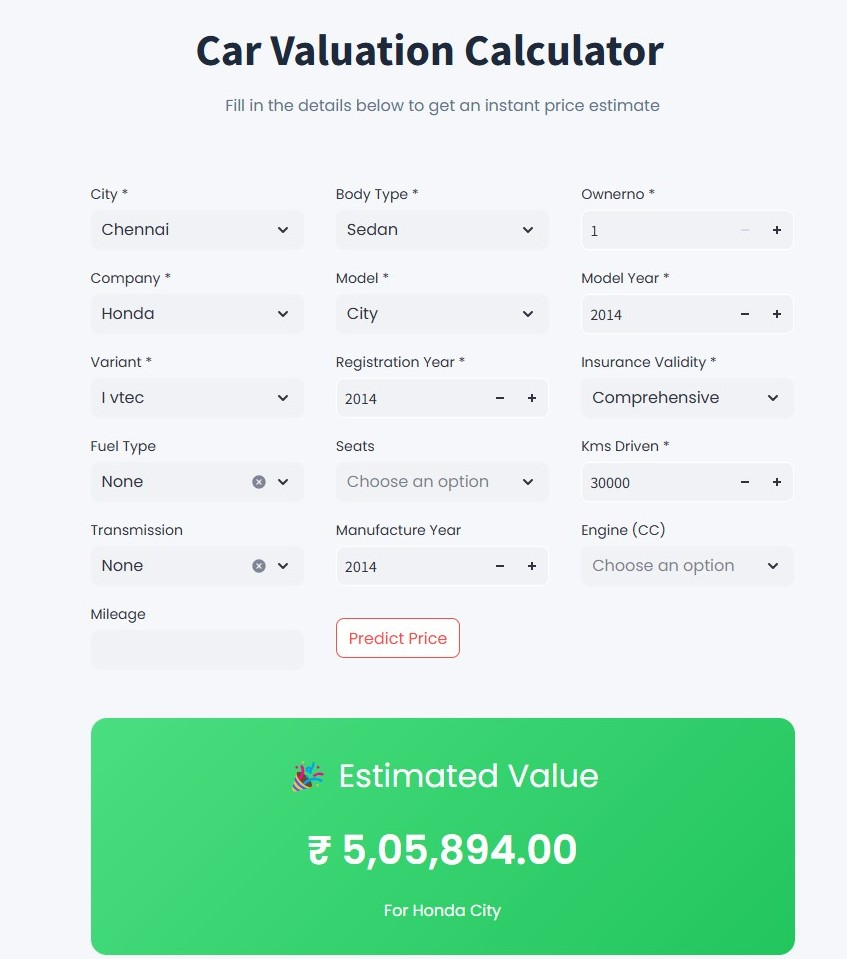

# Car Price Predictor Project
<table>
  <tr>
    <td></td>
    <td></td>
  </tr>
</table>
## Project Overview
The Used Car Price Predictor is a machine learning project that predicts the price of used cars based on various features like model, year of manufacture, mileage, and more. This project consists of several components such as data extraction, data cleaning, exploratory data analysis (EDA), feature selection, model building, and deployment using Streamlit.

The key steps involved in this project are:

    1. Data Extraction from raw files.
    2. Data Cleaning to handle missing values and outliers.
    3. Exploratory Data Analysis (EDA) for visualizing and understanding the data.
    4. Feature Engineering & Model Building to select the best features and choose the optimal model.
    5. Model Deployment via Streamlit UI for car price prediction

## Project Structure
```
car-price-predictor/
│
├── Data_Extracting.py         # Data extraction script
├── Data_Cleaning.py           # Data cleaning methods
├── Data_Cleaning.ipynb        # Detailed data cleaning notebook
├── EDA.ipynb                  # Exploratory Data Analysis notebook
├── Model.ipynb                # Model selection and tuning notebook
├── Cars_Price_Predictor.py    # Streamlit UI and price prediction
└── README.md                  # Project documentation
```

## Prerequisites
   ```
   pip install -r requirements.txt
   ```

## Installation

1. Clone the repository:
   ```
   git clone https://github.com/Pushparaj95/Bus_Data_Management.git
   ```

## Project Workflow

### 1. Data Extraction
Run `Data_Extracting.py` to extract raw data from the source file:
```bash
python Data_Extracting.py
```

### 2. Data Cleaning
Open `Data_Cleaning.ipynb` or run `Data_Cleaning.py` to clean and preprocess the dataset:
- Imputed missing values using Random Forest 
- Removed duplicates
- Performed type conversions
- Applied necessary transformations

### 3. Exploratory Data Analysis (EDA)
Explore the dataset using `EDA.ipynb`:
- Visualized data distributions
- Analyze correlations
- Checking for outliers

### 4. Model Development
Use `Model.ipynb` to:
- Selected best features
- Compared multiple machine learning models
- Applied RandomSearchCV for hyperparameter tuning
- Build and saved the final prediction in pipeline

`ML Models` used:
- Linear Regression
- Decision Trees
- Random Forest
- Gradient Boosting
- XGBoost

### 5. Streamlit Application
Run the price predictor UI:
```bash
streamlit run Cars_Price_Predictor.py
```

## Model Performance
- Best Model: XGBRegressor
- R² Score: 0.954425
- Mean Squared Error: 0.033442

## Key Features
- Data cleaning and preprocessing
- Advanced feature selection
- Multiple model comparison
- Hyperparameter optimization
- Interactive price prediction UI

## Contact
pushparajmadhavan16@gmail.com